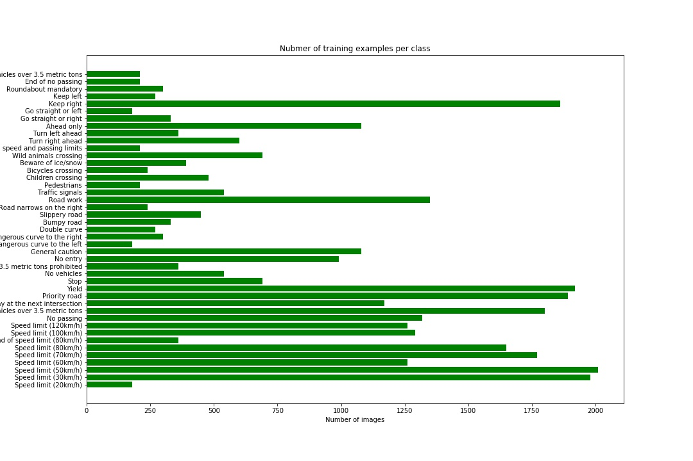
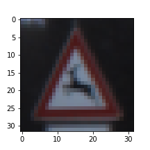

# **Traffic Sign Recognition** 

## Writeup

---

**Build a Traffic Sign Recognition Project**

The goals / steps of this project are the following:
* Load the data set (see below for links to the project data set)
* Explore, summarize and visualize the data set
* Design, train and test a model architecture
* Use the model to make predictions on new images
* Analyze the softmax probabilities of the new images
* Summarize the results with a written report

[//]: # (Image References)

[image2]: ./examples/grayscale.jpg "Grayscaling"
[image3]: ./examples/random_noise.jpg "Random Noise"
[image4]: ./examples/placeholder.png "Traffic Sign 1"
[image5]: ./examples/placeholder.png "Traffic Sign 2"
[image6]: ./examples/placeholder.png "Traffic Sign 3"
[image7]: ./examples/placeholder.png "Traffic Sign 4"
[image8]: ./examples/placeholder.png "Traffic Sign 5"

## Rubric Points
### Here I will consider the [rubric points](https://review.udacity.com/#!/rubrics/481/view) individually and describe how I addressed each point in my implementation.  
---

### Writeup / README

#### 1. Provide a Writeup / README that includes all the rubric points and how you addressed each one. You can submit your writeup as markdown or pdf. You can use this template as a guide for writing the report. The submission includes the project code.

You're reading it!

### Data Set Summary & Exploration

#### 1. Provide a basic summary of the data set. In the code, the analysis should be done using python, numpy and/or pandas methods rather than hardcoding results manually.

I used the pandas library to calculate summary statistics of the traffic
signs data set:

* The size of training set is 34799
* The size of the validation set is 4410
* The size of test set is 12630
* The shape of a traffic sign image is (32, 32, 3)
* The number of unique classes/labels in the data set is 43

#### 2. Include an exploratory visualization of the dataset.

Here is an exploratory visualization of the data set. It is a bar chart showing how the training data is distributed by class

### Design and Test a Model Architecture

#### 1. Describe how you preprocessed the image data. What techniques were chosen and why did you choose these techniques? Consider including images showing the output of each preprocessing technique. Pre-processing refers to techniques such as converting to grayscale, normalization, etc. (OPTIONAL: As described in the "Stand Out Suggestions" part of the rubric, if you generated additional data for training, describe why you decided to generate additional data, how you generated the data, and provide example images of the additional data. Then describe the characteristics of the augmented training set like number of images in the set, number of images for each class, etc.)

As a first step, I decided to convert the images to grayscale because lighting and color adds too much variation to examples, and it will require much more examples to train the model

Here is an example of a traffic sign image before and after grayscaling.

As a last step, I normalized the image data because because this way it is easier to train the model

#### 2. Describe what your final model architecture looks like including model type, layers, layer sizes, connectivity, etc.) Consider including a diagram and/or table describing the final model.

My final model consisted of the following layers:

| Layer         		|     Description	        					| 
|:---------------------:|:---------------------------------------------:| 
| Input         		| 32x32x1 grayscale image   					|
| Convolution 3x3(1)   	| 1x1 stride, valid padding, outputs 28x28x128 	|
| RELU		            |                                               | 
| Dropout				| keep probability .5                           |  
| Max pooling(1)      	| 2x2 stride,  outputs 14x14x128 				|
| Convolution 3x3(2)    | 1x1 stride, valid padding, outputs 10x10x128	|
| Max pooling(2)      	| 2x2 stride,  outputs 5x5x128  				|
| Max pooling(3)      	| takes Max pooling(1) as input, 2x2 stride,    |
|                       | outputs 7x7x128  				                |
| Fully connected(1)	| Takes Max pooling(2) and Max pooling(3) as    |
|                       | input, outputs 100							|
| Fully connected(2)	|                                               |
| Softmax				|            									|

#### 3. Describe how you trained your model. The discussion can include the type of optimizer, the batch size, number of epochs and any hyperparameters such as learning rate.

To train the model, I used .5 as keep probabily parameter for dropout. The Adam algorithm is used for optimization. The model is trained for 100 epochs, with learning rate 0.001 and batch size 128.

#### 4. Describe the approach taken for finding a solution and getting the validation set accuracy to be at least 0.93. Include in the discussion the results on the training, validation and test sets and where in the code these were calculated. Your approach may have been an iterative process, in which case, outline the steps you took to get to the final solution and why you chose those steps. Perhaps your solution involved an already well known implementation or architecture. In this case, discuss why you think the architecture is suitable for the current problem.

My final model results were:
* training set accuracy of 0.999
* validation set accuracy of 0.957
* test set accuracy of 0.934

If a well known architecture was chosen:
* What architecture was chosen?
I used architecture described in this paper http://yann.lecun.com/exdb/publis/pdf/sermanet-ijcnn-11.pdf . 
It is a traditional ConvNet architecture, modified by feeding 1st stage features in addition to 2nd stage features to the classifier.
* Why did you believe it would be relevant to the traffic sign application?
This architecture was applied to the task of traffic sign classification as part of the GTSRB competition. So I decided to just copy it for my project.
* How does the final model's accuracy on the training, validation and test set provide evidence that the model is working well?
Original architecture has reached 98.97% accuracy on traffic sign recognition task.

### Test a Model on New Images

#### 1. Choose five German traffic signs found on the web and provide them in the report. For each image, discuss what quality or qualities might be difficult to classify.

Here are five German traffic signs that I found on the web:

   
 

"Speed limit (70km/h)" sign might be difficult to classify because is similar to "Speed limit (20km/h)" sign  
"Children crossing" sign might be difficult to clasify because of complex people's figures  
"Ahead only" is very similar to other arrow-like signs  
"Priority road" has very little features, except romb shape and color  
"Stop" sing has letters, which may be difficult to recognize at low resolution

#### 2. Discuss the model's predictions on these new traffic signs and compare the results to predicting on the test set. At a minimum, discuss what the predictions were, the accuracy on these new predictions, and compare the accuracy to the accuracy on the test set (OPTIONAL: Discuss the results in more detail as described in the "Stand Out Suggestions" part of the rubric).

Here are the results of the prediction:

| Image			        |     Prediction	        					| 
|:---------------------:|:---------------------------------------------:| 
| Speed limit (70km/h)  | Speed limit (70km/h)   						| 
| Children crossing     | Children crossing                      		|
| Ahead only			| Ahead only									|
| Priority road	      	| Priority road 				 				|
| Stop			        | Speed limit (60km/h) 							|

The model was able to correctly guess 4 of the 5 traffic signs, which gives an accuracy of 80%. This is worse than 93.4% that I got on test set.

#### 3. Describe how certain the model is when predicting on each of the five new images by looking at the softmax probabilities for each prediction. Provide the top 5 softmax probabilities for each image along with the sign type of each probability. (OPTIONAL: as described in the "Stand Out Suggestions" part of the rubric, visualizations can also be provided such as bar charts)

The code for making predictions on my final model is located in the 51th cell of the Ipython notebook.

For the first image, the model is completely sure that this is a Speed limit (70km/h) sign (probability of .93), and the prediction is correct. The top five soft max probabilities were

| Probability         	|     Prediction	        					| 
|:---------------------:|:---------------------------------------------:| 
| .93         			| Speed limit (70km/h) 							| 
| 6.0909465e-02     	| Speed limit (20km/h) 							|
| 9.91532989e-09		| Speed limit (30km/h)							|
| 2.63868823e-11	    | Speed limit (60km/h)			 				|
| 2.00707669e-13		| Speed limit (120km/h)    						|

For the second image, the model is completely sure that this is a Children crossing sign (probability of 0.99), and the prediction is correct. The top five soft max probabilities were

| Probability         	|     Prediction	        					| 
|:---------------------:|:---------------------------------------------:| 
| .99         			| Children crossing   		                    | 
| 6.50445713e-07     	| Right-of-way at the next intersection 		|
| 6.25950625e-09		| Speed limit (60km/h)							|
| 3.72544395e-09	    | Pedestrians                					|
| 1.05222726e-10		| Dangerous curve to the left   				|

For the third image, the model is completely sure that this is a Ahead only sign (probability of 0.99), and the prediction is correct. The top five soft max probabilities were

| Probability         	|     Prediction	        					| 
|:---------------------:|:---------------------------------------------:| 
| 0.99         			| Ahead only   									| 
| 1.3928113e-10     	| Yield 										|
| 1.1458318e-12			| Priority road									|
| 1.3326577e-13	      	| Speed limit (60km/h)					 		|
| 1.7614978e-14			| No passing      							    |

For the forth image, the model is completely sure that this is a Priority road sign (probability of 0.99), and the prediction is correct. The top five soft max probabilities were

| Probability         	|     Prediction	        					| 
|:---------------------:|:---------------------------------------------:| 
| 0.99         			| Priority road   								| 
| 4.1416447e-15			| Ahead only 									|
| 6.37214e-17 			| Stop											|
| 3.375843e-21 			| No passing					 				|
| 9.747884e-22		    | Children crossing    							|

For the fifth image, the model is almost sure that this is a Speed limit (60km/h) sign (probability of 0.95), but the image shows a Stop sign. The top five soft max probabilities were

| Probability         	|     Prediction	        					| 
|:---------------------:|:---------------------------------------------:| 
| 0.9501321         	| Speed limit (60km/h)   					    | 
| 0.048662927    		| Stop							             	|
| 0.0011762282			| Dangerous curve to the left    				|
| 1.18491635e-05      	| No entry			    		 				|
| 9.463262e-06			| Go straight or left  							|

